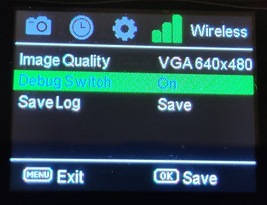
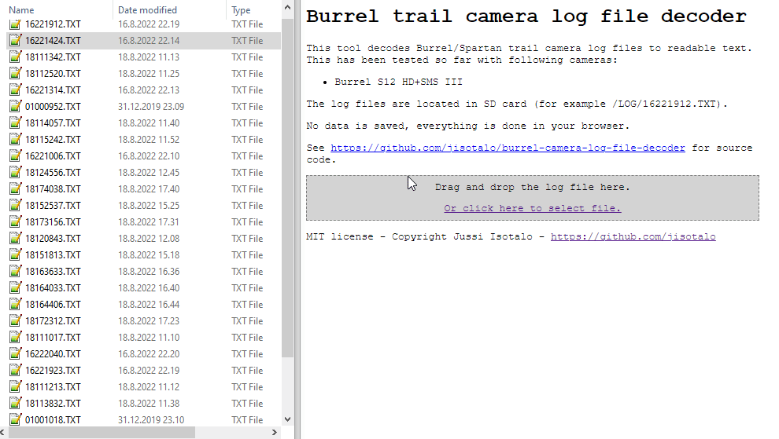

# Burrel trail camera log file decoder

  This tool decodes Burrel/Spartan trail camera log files to readable text.

  This has been tested so far with following cameras:
  * Burrel S12 HD+SMS III

  The log files are located in SD card (for example /LOG/16221912.TXT).

  To make camera to save logs you need to enable `Debug Switch` from wireless settings. You can also manually save the log by selecting `Save Log`.

  

## Live version
You can use this tool at [https://jisotalo.github.io/others/burrel-camera-log-file-decoder.html](https://jisotalo.github.io/others/burrel-camera-log-file-decoder.html).

## Burrel-riistakameran lokitiedostojen avaaja

Tämä työkalu muuttaa Burrel-riistakameroiden lokitiedostot selväkielisiksi.

Toistaiseksi työkalu on testattu seuraavilla kameroilla:
  * Burrel S12 HD+SMS III

Lokitiedostot löytyvät muistikortilta (esim. /LOG/16221912.TXT).

Jotta kamera tallentaa lokitiedostoja, täytyy asetus `Debug Switch` laittaa päälle lähetysasetuksista. Lokin voi myös tallentaa käsin valitsemalla `Save Log` (tallenna loki).

# License

Licensed under [MIT License](http://www.opensource.org/licenses/MIT).

Copyright (c) 2022 Jussi Isotalo <<j.isotalo91@gmail.com>>

Permission is hereby granted, free of charge, to any person obtaining a copy
of this software and associated documentation files (the "Software"), to deal
in the Software without restriction, including without limitation the rights
to use, copy, modify, merge, publish, distribute, sublicense, and/or sell
copies of the Software, and to permit persons to whom the Software is
furnished to do so, subject to the following conditions:

The above copyright notice and this permission notice shall be included in all
copies or substantial portions of the Software.

THE SOFTWARE IS PROVIDED "AS IS", WITHOUT WARRANTY OF ANY KIND, EXPRESS OR
IMPLIED, INCLUDING BUT NOT LIMITED TO THE WARRANTIES OF MERCHANTABILITY,
FITNESS FOR A PARTICULAR PURPOSE AND NONINFRINGEMENT. IN NO EVENT SHALL THE
AUTHORS OR COPYRIGHT HOLDERS BE LIABLE FOR ANY CLAIM, DAMAGES OR OTHER
LIABILITY, WHETHER IN AN ACTION OF CONTRACT, TORT OR OTHERWISE, ARISING FROM,
OUT OF OR IN CONNECTION WITH THE SOFTWARE OR THE USE OR OTHER DEALINGS IN THE
SOFTWARE.
